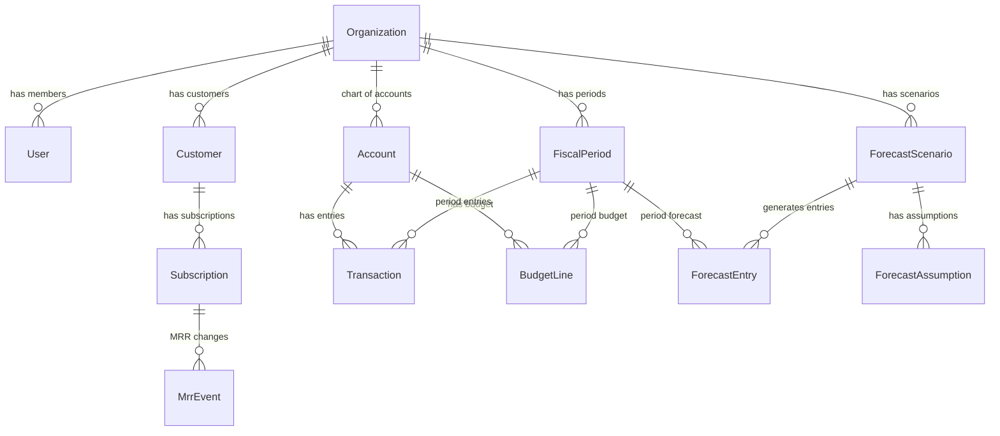

# Sistema de Forecast Financeiro — Bravy

## Visao de CFO

Como CFO de um SaaS, o forecast e o instrumento mais critico para tomar decisoes. O sistema precisa responder a **5 perguntas fundamentais** a qualquer momento:

1. **Quanto vamos faturar nos proximos 12 meses?** (Revenue Forecast)
2. **Quanto vamos gastar?** (Expense Forecast)
3. **Quando o dinheiro acaba?** (Runway / Cash Flow)
4. **Estamos dentro do orcamento?** (Budget vs Actual)
5. **E se o cenario mudar?** (Scenario Planning)

---

## Arquitetura de Repositorios (padrao Bravy)

- `bravy-forecast-api` — Backend NestJS
- `bravy-forecast-web` — Frontend Next.js (App Router)
- Comunicacao via REST `/api/v1/`
- Banco PostgreSQL + Prisma ORM
- Auth JWT + RBAC (Owner, Admin, Viewer)

---

## Modelo de Dados (Prisma) — Visao de CFO



### Entidades Core

- **Organization** — Tenant (empresa). Tudo e isolado por org.
- **User** — Membro com role (OWNER, ADMIN, VIEWER). Um user pode estar em varias orgs.
- **Customer** — Cliente do SaaS (quem paga). Rastreia MRR individual.
- **Subscription** — Assinatura ativa de um customer. Plano, valor, status, datas.
- **MrrEvent** — Cada mudanca de MRR: NEW, EXPANSION, CONTRACTION, CHURN, REACTIVATION. Isso e o coracao do forecast de receita SaaS.
- **Account** — Plano de contas (ex: "Salarios", "Servidores AWS", "Marketing"). Categorizado por tipo: REVENUE, COGS, OPEX, CAPEX, TAX.
- **Transaction** — Lancamento financeiro real (realizado). Vinculado a conta + periodo.
- **BudgetLine** — Valor orcado por conta por periodo.
- **FiscalPeriod** — Mes/trimestre do ano fiscal.
- **ForecastScenario** — Cenario (Base, Otimista, Pessimista).
- **ForecastAssumption** — Premissa do cenario (ex: "crescimento MRR mensal = 8%", "churn = 3%").
- **ForecastEntry** — Valor projetado por cenario por conta por periodo.

---

## Fases de Entrega (Roadmap de PO)

### FASE 1 — Fundacao e Estrutura (Sprint 1-2)

**Objetivo:** Ter o sistema rodando com auth, multi-tenant e cadastros base.

**Backend:**

- Setup do projeto NestJS (main.ts, Swagger, CORS, ValidationPipe)
- Modulos: auth, users, organizations
- Prisma schema: User, Organization, UserOrganization (many-to-many com role)
- JWT auth com access + refresh token
- RBAC guard (Owner, Admin, Viewer)
- Seed com org de exemplo

**Frontend:**

- Setup do projeto Next.js (App Router)
- Layout base: sidebar + header + content area
- Paginas: login, registro, selecao de organizacao
- Auth provider + interceptors axios
- shadcn/ui + Tailwind configurados

**Entregavel:** Login funcional, criar org, convidar membros.

---

### FASE 2 — Plano de Contas e Lancamentos (Sprint 3-4)

**Objetivo:** Poder registrar dados financeiros reais.

**Backend:**

- Modulos: accounts, transactions, fiscal-periods
- Plano de contas pre-configurado para SaaS (template com ~30 contas)
- CRUD de lancamentos com validacao
- Periodos fiscais automaticos (gera 12 meses ao criar org)
- Endpoints de totalizacao por periodo/conta

**Frontend:**

- Pagina de plano de contas (arvore hierarquica)
- Formulario de lancamento financeiro
- Listagem de lancamentos com filtros (periodo, conta, tipo)
- Resumo mensal (tabela com totais por conta)

**Template de Plano de Contas SaaS (como CFO defino):**

- RECEITA: MRR, Receita Avulsa, Servicos
- COGS: Infraestrutura, Suporte, Onboarding
- OPEX Vendas: Salarios Vendas, Comissoes, Marketing, Ferramentas
- OPEX P&D: Salarios Dev, Ferramentas Dev, Treinamento
- OPEX G&A: Salarios Adm, Contabilidade, Juridico, Escritorio
- CAPEX: Equipamentos
- IMPOSTOS: ISS, PIS, COFINS, IR, CSLL

**Entregavel:** Registrar receitas e despesas, ver totais por periodo.

---

### FASE 3 — Receita SaaS e MRR (Sprint 5-6)

**Objetivo:** Rastrear MRR com granularidade de SaaS.

**Backend:**

- Modulos: customers, subscriptions, mrr-events
- Calculo automatico de MRR a partir de subscriptions ativas
- Registro de eventos: NEW_MRR, EXPANSION, CONTRACTION, CHURN, REACTIVATION
- Endpoint de MRR historico (waterfall mensal)
- Endpoint de metricas: MRR atual, ARR, net new MRR, churn rate, ARPU

**Frontend:**

- Cadastro de clientes e assinaturas
- Dashboard de MRR com grafico waterfall (new + expansion - contraction - churn)
- Tabela de movimentacao de MRR por mes
- Card de metricas: MRR, ARR, Churn %, ARPU, Clientes ativos

**Entregavel:** Visao completa da receita recorrente historica.

---

### FASE 4 — Forecast Engine e Cenarios (Sprint 7-8)

**Objetivo:** Projetar o futuro financeiro com premissas configuráveis.

**Backend:**

- Modulos: forecast-scenarios, forecast-assumptions, forecast-entries
- Engine de calculo: a partir de premissas, gera projecao de 12 meses
- Premissas de receita: % crescimento MRR, % churn, sazonalidade
- Premissas de despesa: % aumento headcount, inflacao, custos variaveis como % da receita
- 3 cenarios default: Base (historico), Otimista (+30%), Pessimista (-30%)
- Recalculo sob demanda (muda premissa, recalcula tudo)
- Endpoint de comparacao entre cenarios

**Frontend:**

- Tela de cenarios com cards (Base, Otimista, Pessimista)
- Editor de premissas por cenario (sliders e inputs)
- Grafico de projecao de receita (3 linhas, uma por cenario)
- Grafico de projecao de despesas
- Botao "Recalcular Forecast"

**Entregavel:** Projecao financeira de 12 meses com 3 cenarios.

---

### FASE 5 — DRE, Fluxo de Caixa e Budget vs Actual (Sprint 9-10)

**Objetivo:** Demonstrativos financeiros completos.

**Backend:**

- Modulo: reports
- DRE (P&L) projetado: Receita - COGS = Lucro Bruto - OPEX = EBITDA
- Fluxo de Caixa: Operacional + Investimento + Financiamento = Saldo
- Calculo de Runway (meses ate o caixa zerar no cenario base)
- Budget vs Actual: comparativo orcado vs realizado com variancia ($ e %)
- Endpoints de exportacao (JSON estruturado para tabelas)

**Frontend:**

- Pagina DRE com tabela formatada (receita em cima, lucro liquido embaixo)
- Pagina Fluxo de Caixa com grafico de area (entradas vs saidas)
- Indicador de Runway em destaque
- Pagina Budget vs Actual com tabela comparativa + barras de variancia
- Filtros de periodo (mensal, trimestral, anual)

**Entregavel:** CFO tem visao completa: DRE, cash flow, runway, budget.

---

### FASE 6 — Dashboard de KPIs e Polish (Sprint 11-12)

**Objetivo:** Tela unica com a saude financeira do negocio.

**Backend:**

- Modulo: kpis
- Calculo de todos os KPIs SaaS:
  - MRR, ARR, Net New MRR
  - Gross Churn Rate, Net Revenue Retention (NRR)
  - CAC (se tiver dados de marketing), LTV, LTV:CAC
  - Burn Rate (despesas - receita no mes), Gross Burn, Net Burn
  - Runway (caixa / net burn)
  - Gross Margin %, EBITDA Margin %
  - ARPU (Average Revenue Per User)
  - Quick Ratio (new + expansion) / (contraction + churn)

**Frontend:**

- Dashboard principal com grid de cards de KPIs
- Cada KPI com: valor atual, variacao vs mes anterior, sparkline 6 meses
- Semaforo visual (verde/amarelo/vermelho baseado em benchmarks SaaS)
- Graficos de tendencia para KPIs criticos
- Export para PDF (relatorio mensal para board)

**Entregavel:** Dashboard executivo completo.

---

## Estrutura de Pastas (Bravy Standard)

### Backend (`bravy-forecast-api/`)

```
src/
├── common/
│   ├── decorators/
│   ├── filters/
│   ├── guards/
│   ├── interceptors/
│   ├── pipes/
│   └── utils/
├── config/
├── prisma/
│   ├── schema.prisma
│   ├── seed.ts
│   └── migrations/
└── modules/
    ├── auth/
    ├── users/
    ├── organizations/
    ├── accounts/
    ├── transactions/
    ├── fiscal-periods/
    ├── customers/
    ├── subscriptions/
    ├── mrr-events/
    ├── forecast-scenarios/
    ├── forecast-entries/
    ├── budgets/
    ├── reports/
    └── kpis/
```

### Frontend (`bravy-forecast-web/`)

```
src/
├── app/
│   ├── (auth)/
│   │   ├── login/
│   │   └── register/
│   └── (dashboard)/
│       ├── overview/
│       ├── revenue/
│       ├── expenses/
│       ├── forecast/
│       ├── reports/
│       │   ├── pnl/
│       │   ├── cashflow/
│       │   └── budget-vs-actual/
│       ├── customers/
│       ├── settings/
│       └── layout.tsx
├── components/
│   ├── ui/ (shadcn)
│   ├── layout/
│   └── shared/
├── features/
│   ├── auth/
│   ├── accounts/
│   ├── transactions/
│   ├── revenue/
│   ├── forecast/
│   ├── reports/
│   └── kpis/
├── hooks/
├── lib/
├── services/
├── stores/
└── types/
```

---

## Decisoes Tecnicas de CFO/PO

- **Moeda:** BRL como padrao, mas o model suporta campo currency para internacionalizacao futura
- **Precisao:** Todos os valores monetarios em `Decimal` (Prisma) — nunca `Float`
- **Periodos:** Mensal como granularidade base, trimestral e anual sao agregacoes
- **Ano fiscal:** Configuravel por org (default Jan-Dez)
- **Charts:** Recharts (leve, React-native, boa integracao com shadcn)
- **Multi-tenant:** Isolamento por `organizationId` em TODAS as queries (middleware Prisma)
- **Soft delete:** Em todas as entidades (padrao Bravy)
- **Auditoria:** Campo `createdBy`/`updatedBy` em lancamentos e budgets
